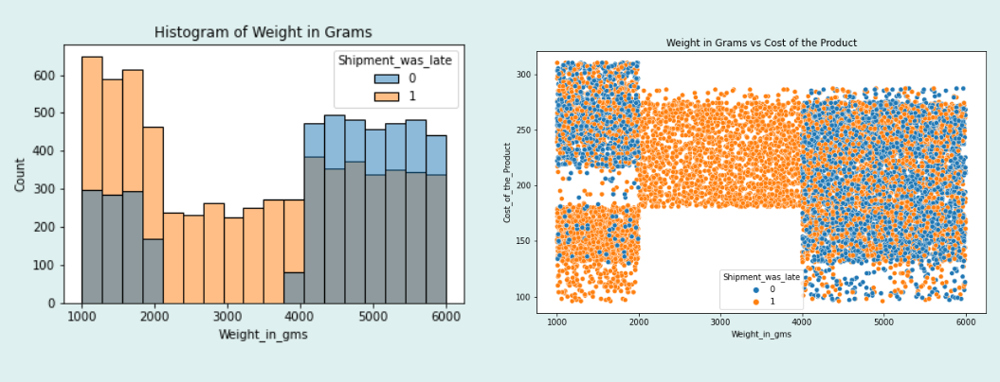
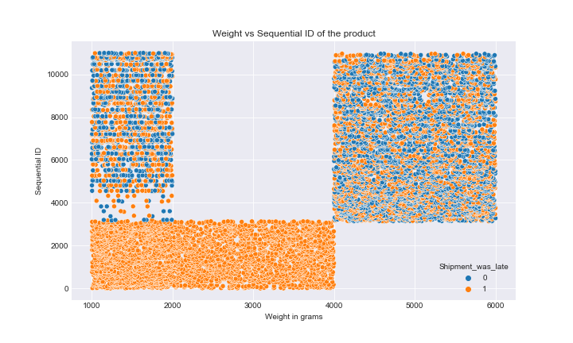

# E-Commerce Shipment On-Time Delivery


### Analysis Overview

This project analyzes an E-commerce shipment record csv file. We will perform Exporatory Data Analysys (EDA) to assess the data, and create machine learning models to predict the outcome of a target variable (on-time vs. late delivery classification).


### Business Problem

The company has experienced decline in customer satisfaction and market share at one of its major distribution centers due to <u>excessive late deliveries</u>.

We are charged with: 
- Analyze the shipping data to find root cause of lateness.
- Create a model to predict if a shipment will be late, so that the company can  preemptively take corrective action.


### Data

The dataset used in this analysis contained records of 11,000 shipments, including details regarding:
- ID 
- Warehouse block
- Mode of shipment
- Customer care calls
- Customer rating
- Cost of product
- Prior purchases
- Product importance
- Gender
- Discount offered
- Weight
- Was the shipment late?

Source: https://www.kaggle.com/datasets/prachi13/customer-analytics

### Methods

This project uses descriptive analysis and machine learning models to predict whether a shipment will be late or on-time:
- Data was analyzed for cleanliness:
    - There was no missingness in the raw data in the form of NaN or dummy categories 
    - Extreme outliers in the 'Weight_in_gms' column were removed prior to modeling
- Target variable for predictive modeling is 'Reached.on.Time_Y.N'
    - 'Reached.on.Time_Y.N' interpretation: 1 indicates that a shipment was late, 0 indicates on-time

### Results

Initial descriptive analysis revealed some problems in the raw data, such as:
- 'Weight_in_gms' distribution is highly segmented with respect to 'ID' and 'Cost_of_the_Product'
- Every single shipment in the weight range 2000 - 4000gm was late


- It appears as though 'Discount_offered' of more than $10 is in response to prior knowledge that a shipment is/will be late:


For the Medium class, there were six models that had zero fatalities, so we evaluate those models based on non-fatal injury rates:


For the Small class, all models had fatalities, so we evaluate those models based on fatal injury rates:


# Conclusions

- For the Medium Class aircraft models, we recommend the following, which had the lowest injury rates:
    1. Boeing 757-223
    2. Boeing 737-7H4
    3. Boeing 737
 
 
- For the Large Class aircraft models, we recommend the following, which had the lowest injury rates:
    1. Airbus A321
    2. Boeing 757-222
    3. Boeing 747-400
 
 
- We <u>do not</u> recommend the use of Small Class planes because their fatality rate is much higher.
    - If necessary, small class aircraft with the lowest injury rates were:
        1. Cessna 180
        2. Cessna 152
        3. Cessna 172 

# Next Steps
- Analyze geographic location effects for recommended models to optimize safety
- Acquire non-accident flight record data to analyze the volume of safe flights by model and potential markets
- Return on Investment (ROI) analysis based on MSRP data, purchase availability and loan rates for safe model recommendations

## For More Information

To see the full data analysis check out the [Jupyter Notebook](./Aircraft_Safety_Risk_Analysis.ipynb) or review the [presentation](./Aircraft_Safety_Risk_Analysis_Presentation.pdf)

Also see the Tableau dashboard interactive visuals here: [Tableau Dashboard](https://public.tableau.com/app/profile/dale.deford/viz/Aircraft_Safety_Risk_Analysis_Dashboard/DASHBOARD?publish=yes)

For any additional questions contact Dale Deford or James Warsing

Dale Deford: daledeford@gmail.com

James Warsing: warsingjt@gmail.com

## Repository Structure

```
├── data
├── images
├── README.md
├── Aircraft_Safety_Risk_Analysis_Dashboard.twb
├── Aircraft_Safety_Risk_Analysis_Presentation.pdf
└── Aircraft_Safety_Risk_Analysis.ipynb
```


```python

```
