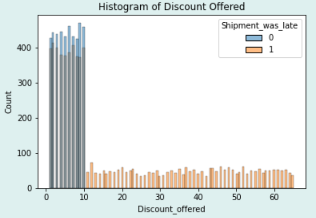
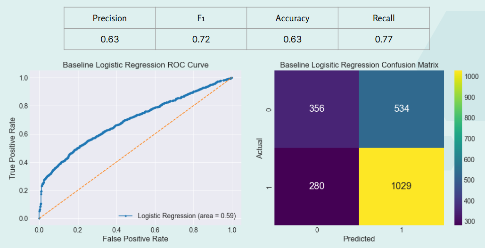
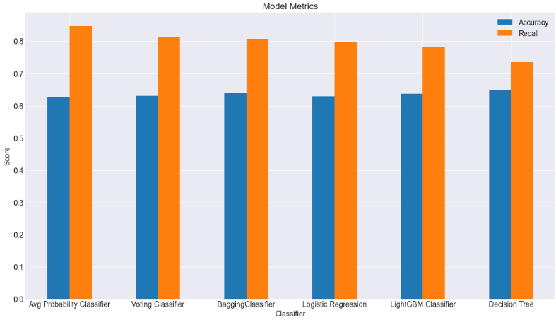
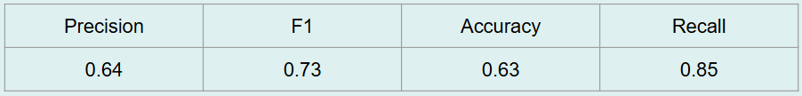

# E-Commerce Shipment On-Time Delivery
## Analysis Overview
This project analyzes an E-commerce shipment record csv file. We will perform Exporatory Data Analysys (EDA) to assess the data, and create machine learning models to predict the outcome of a target variable (on-time vs. late delivery classification).

## Business Problem
The company has experienced decline in customer satisfaction and market share at one of its major distribution centers due to <u>excessive late deliveries</u>.

We are charged with: 
- Analyze the shipping data to find root cause of lateness.
- Create a model to predict if a shipment will be late, so that the company can  preemptively take corrective action.  

## Data
The dataset used in this analysis contained records of 11,000 shipments, including details regarding:
- ID 
- Warehouse block
- Mode of shipment
- Customer care calls
- Customer rating
- Cost of product
- Prior purchases
- Product importance
- Gender
- Discount offered
- Weight
- Was the shipment late?

Source: https://www.kaggle.com/datasets/prachi13/customer-analytics

## Methods
This project uses descriptive analysis and machine learning models to predict whether a shipment will be late or on-time:
- Data was analyzed for cleanliness:
    - There was no missingness in the raw data in the form of NaN or dummy categories 
    - Extreme outliers in the 'Weight_in_gms' column were removed prior to modeling
- Target variable for predictive modeling is 'Shipment_was_late'
    - 'Shipment_was_late' interpretation: 1 indicates that a shipment was late, 0 indicates on-time

## Results
Initial descriptive analysis revealed some problems in the raw data, such as:
- 'Weight_in_gms' distribution is highly segmented with respect to 'Cost_of_the_Product'
- Every single shipment in the weight range 2000 - 4000gm was late


- 'Discount_offered' of more than $10 may be in response to prior knowledge that a shipment is late.  Thus, we are excluding 'Discount_offered' from the model to avoid potential data leakage:


The predictive models were evaluated with priority on Recall Score, in order to minimize false-negatives (we want to have the highest chance of detecting late shipments).  Secondary metric evaluated was Accuracy.

The baseline predictive model was Logistic Regression with no hyperparameter tuning, with the following results:


Here are the results of all models evaluated in thier final-tuning form:


## Conclusions
Best Model: Average Probability Classifier:
- Highest Primary Metric: Recall
- Accuracy was not the highest, but comparable to other models
- Combines predictions from multiple models
- Final Metrics:


 
## Recommendations
1. Back to square 1: Business Understanding <-> Data Understanding. Address and correct problems in the raw data.
2. Improve data acquisition methods to increase performance of future models
3. Implement the Average Probability Classification model as a stop-gap to avoid late shipments until items 1 and 2 can be addressed

## Next Steps
1. Prioritize focus on Business/Data Understanding; answer:
   - Are discounts offered over $10 due to prior knowledge lateness?
   - Root cause(s) for segmentation in shipment weight data 
   - Root cause(s) for segmentation in ID… is the data time sequential?
2. Investigate improving data acquisition: 
   - What data can we gather that will help us better predict lateness?
3. Deployment of Average Probability Classification, predict late shipments:
   - Flag potential late shipments for expediting delivery
   - If lateness cannot be corrected, preemptively engage with customer to inform, offer discount, etc.

## For More Information
To see the full data analysis check out the [Jupyter Notebook](./E-commerce_Shipping_Notebook.ipynb) or review the [presentation](./E-commerce_Shipping_Presentation.pdf)

For any additional questions contact Dale DeFord or Brian Woo

Dale Deford: daledeford@gmail.com

Brian Woo: brianhwwoo@gmail.com

## Repository Structure
```
├── data
├── images
├── mygraphs.py
├── README.md
├── E-commerce_Shipping_Presentation.pdf
└── E-commerce_Shipping_Notebook.ipynb
```